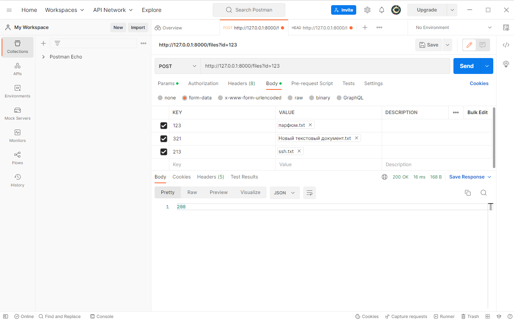
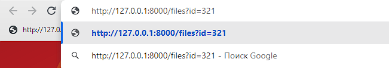

# File Manager

Small service which has 3 endpoint: POST - to push file, GET - to get file by id, 
HEAD - to get information about the file

## Setup

1 ) Clone the repository

````commandline
git clone https://github.com/KrizisN/file_manager.git
````

2 ) Activate env
```commandline
virtualenv venv
source venv/bin/activate (for linux or mac os)
venv\Scripts\activate (for Windows)
```

3 ) Install requirements.txt
```commandline
pip install -r requirements.txt
```

4 ) Initialized database
```commandline
python create_sqlite_db.py
flask db init
```

5 ) Make migrations
```commandline
flask db migrate
flask db upgrade
```


## Run application

You can use IDE configuration or just terminal, `Script Path = app.py` or just 
```commandline
pyhton app.py
```

Using POSTMAN you can enter some files to db (POST endpoint)


If you enter http://127.0.0.1:8000/files?id={YOUR_ID} in your browser



you will get a file from db


and also you can trig head method to know information about the file.


